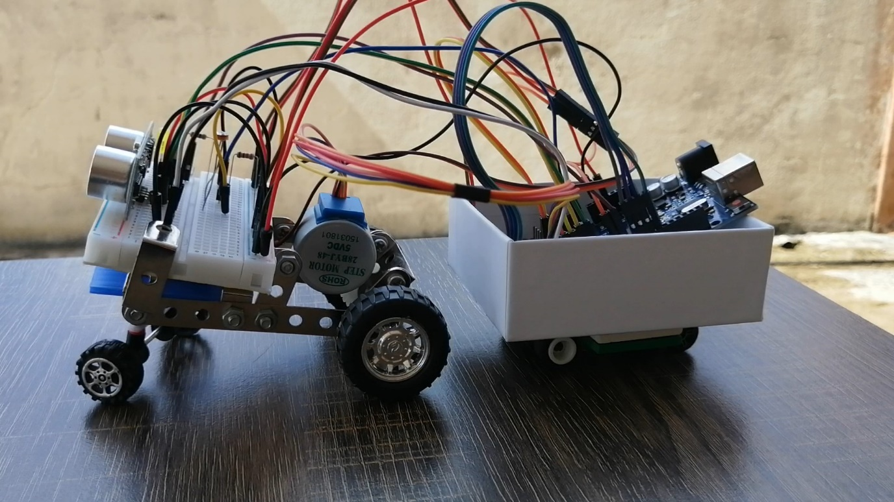
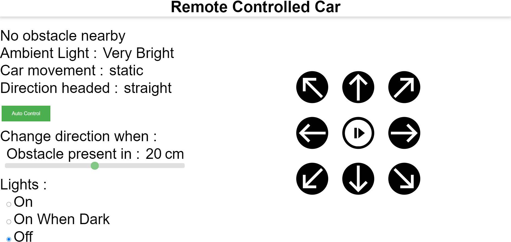
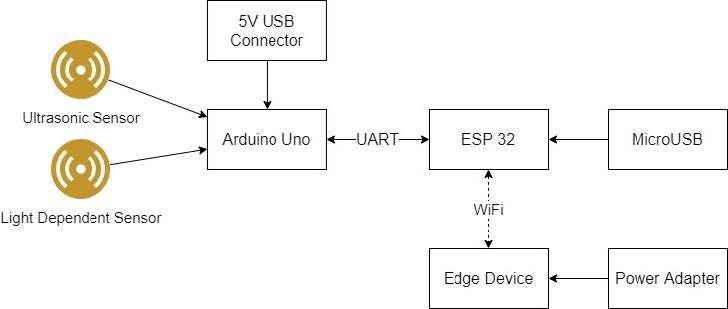
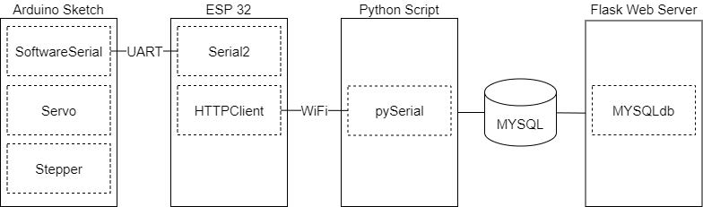

# IoT Automobile
IoT automotive with different sensors and actuators including a light dependent resistor, an ultrasonic sensor, a stepper motor, a light-emitting diode (LED), as well as a servo motor. Controllable via web interface hosted using Python Flask.

 <table>
  <tr>
   <td>Prototype</td>
   <td>Web Interface</td>
  </tr>
  <tr>
  <td>
   
  </td>
  <td>
   
  </td>
  </tr>
  <tr>
   <td>Hardware Structure</td>
   <td>Software Structure</td>
  </tr>
  <tr>
  <td>
   
  </td>
  <td>
   
  </td>
  </tr>
 </table>  

  

 # What I learned
 * Programming microcontrollers such as Arduino Uno and ESP32 as well as Raspberry Pi
 * Using Arduino to connect and manipulate different sensors, actuators and other components
 * Hosting a website using Python Flask
 * Assemble parts together to form a prototype

# Video Presentation

 

 
